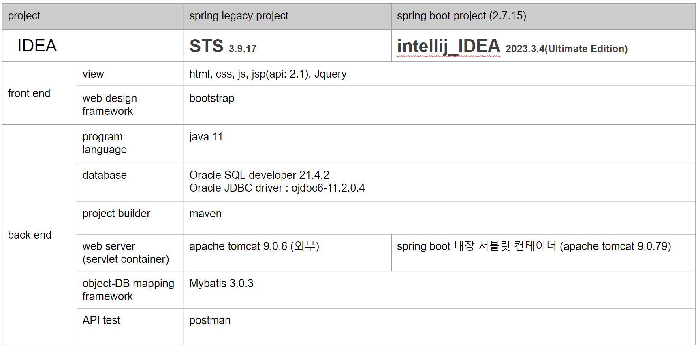
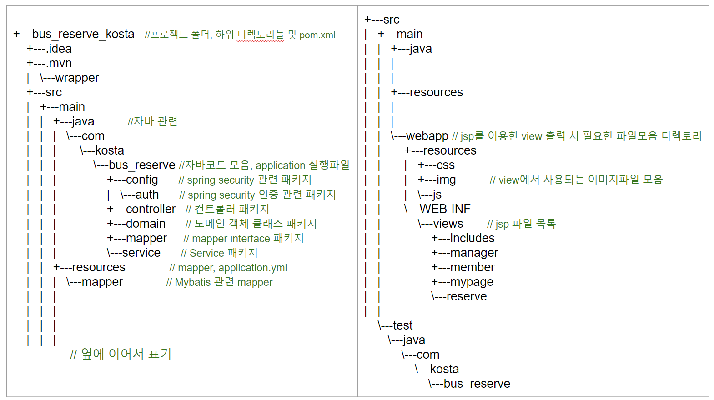
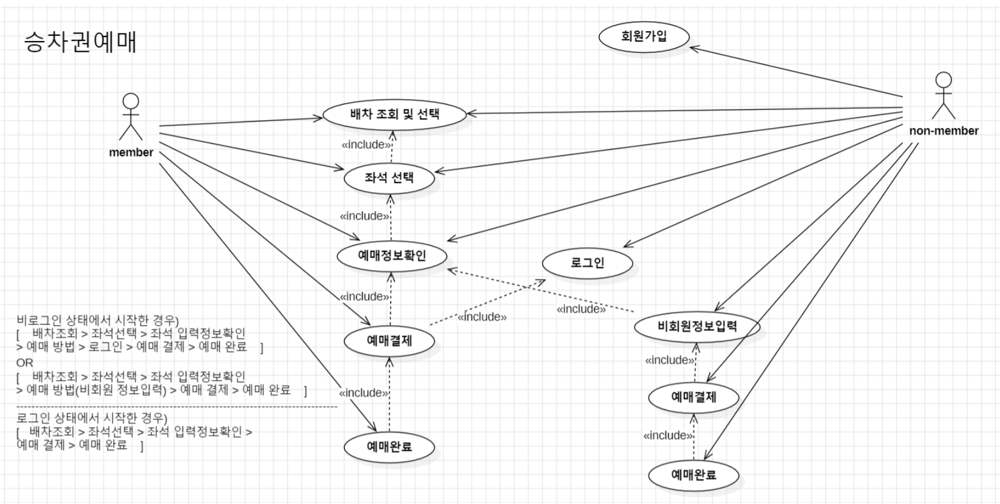
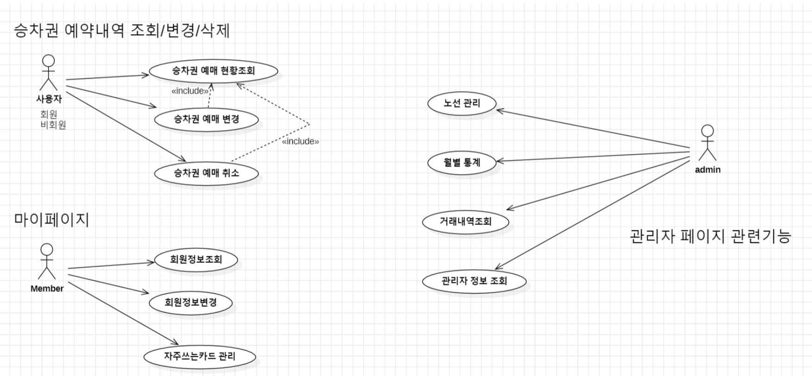
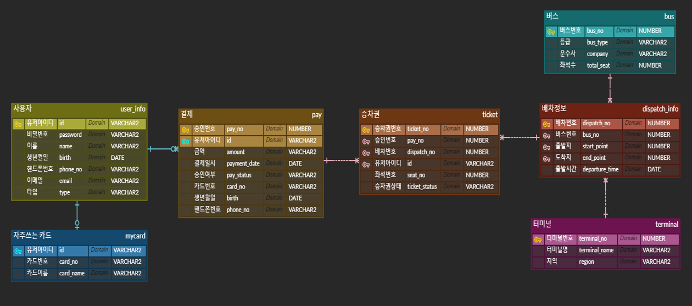

**프로젝트 소개**

**프로젝트 주제 : 시외버스 예매, 구매, 발권 서비스**

- 웹 프로젝트는 KOSTA - JAVA기반 클라우드 웹 서비스 개발자 양성과정 진행 중에 이루어졌습니다.
    
    2024.03.11 ~ 2024.03.25 (1차, 14일)  - spring legacy
    
    2024.04.08 ~ 2024.04.19 (2차, 11일) - spring boot
    
- 총 소요시간 25일 / (본인 포함) 4명의 조원이 함께 진행하였습니다.
---
### 통합개발환경 세팅
   
### project structure overview 패키지/폴더 구조
   

---
### 팀 구성 및 역할   
한송희 : UI master    
  • 화면 레이아웃    
  • 관리자 정보 조회 기능   
  • 배차 관리 기능   
  • 결제내역 조회 기능   
  
한온정 : Document master    
  • 회의록 작성 및 기타 문서 작업   
  • 회원가입/로그인 기능   
  • 마이페이지 기능   
  • 예매내역 조회 기능   
  
황슬찬 : DB master    
  • Database 설계   
  • Database 구축   
  • 시스템흐름도 작성   
  • 예매결제/비회원 정보입력 기능   

이재은 : Git Master & PM   
  • 배차조회, 좌석선택, 입력정보확인 기능, 승차권 발매   
  • git 브랜치 전략 수립   
  • github 브랜치관리, PR 관리   
  
---

### 유스케이스 다이어그램
   

---

### ER 다이어그램

---
### 내가 만든 기능 시연(배차조회,선택 / 좌석선택)

